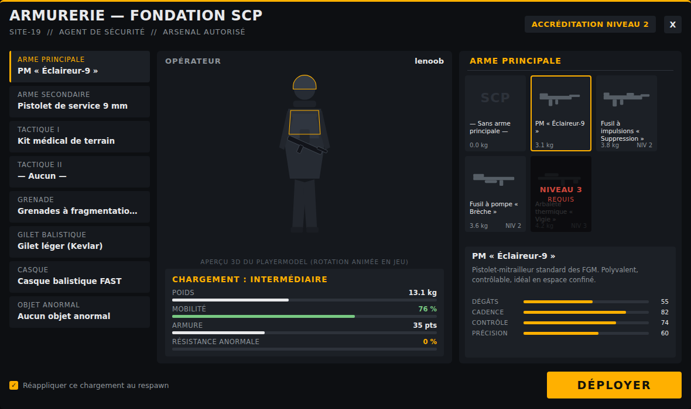

# SCP Armory

Addon **Garry's Mod** : une armurerie de la Fondation SCP avec un écran de préparation de loadout
inspiré de **Ready or Not** — sélection par emplacements, aperçu 3D de l'opérateur, poids qui
pénalise la mobilité, niveaux d'accréditation, restrictions par job et objets anormaux.



## Fonctionnalités

- **Menu de loadout façon Ready or Not** (Derma) :
  - 8 emplacements : arme principale, arme secondaire, tactique ×2, grenade, gilet balistique, casque, objet anormal ;
  - grille d'objets avec icônes 3D, description et statistiques (dégâts, cadence, contrôle, précision) ;
  - aperçu 3D animé de votre playermodel ;
  - jauges agrégées en direct : **poids**, **mobilité**, **armure**, **résistance anormale**, avec classe de
    chargement `LÉGER / INTERMÉDIAIRE / LOURD`.
- **Fonctionnel en jeu** au clic sur **DÉPLOYER** :
  - distribution des armes et munitions (validation côté serveur) ;
  - armure appliquée selon gilet + casque ;
  - vitesse de déplacement recalculée selon le poids total ;
  - effets des objets anormaux : **SCP-500** (soin complet), **SCP-714** (-25 % de dégâts subis, mobilité réduite),
    **Ancre de Réalité Scranton** (-15 % de dégâts subis, 6,5 kg) ;
  - réapplication optionnelle du chargement au respawn.
- **Entité armurerie** (`scp_armory_locker`) : un casier à placer sur la map (menu spawn, catégorie
  *SCP Armory*), avec étiquette 3D2D « ARMURERIE — Appuyez sur [E] ». Appuyer sur **E** ouvre le menu.
  Avec `RequireEntity = true`, s'équiper n'est possible **qu'à proximité d'un casier**, comme dans Ready or Not.
- **Restrictions par job/team** : un objet portant un champ `jobs = { ... }` n'apparaît **que** pour ces
  métiers — les autres joueurs ne le voient même pas dans le menu (validation serveur incluse).
- **Niveaux d'accréditation (1-4)** : les objets verrouillés sont grisés dans le menu et refusés par le
  serveur. Attribuables par groupe (`ClearanceGroups`) ou par job (`ClearanceJobs`).
- **Sauvegarde locale** du dernier loadout (`data/scp_armory/loadout.txt`).

## Installation

Clonez (ou copiez) le dépôt dans le dossier `addons` de Garry's Mod :

```
garrysmod/addons/scp-armory/
├── addon.json
└── lua/
    ├── autorun/scp_armory_init.lua
    └── scp_armory/...
```

## Utilisation

- **Casier d'armurerie** : spawnez l'entité *Casier d'armurerie SCP* (catégorie *SCP Armory*) et
  appuyez sur **E** dessus.
- Commande chat : `!armurerie`, `!loadout` ou `!armory`
- Commande console : `scp_armory` (bindable : `bind F7 scp_armory`)
- Choisissez vos objets par emplacement puis cliquez **DÉPLOYER**.

## Configuration

Dans `lua/scp_armory/sh_config.lua` :

| Option | Rôle |
| --- | --- |
| `DefaultClearance` | Accréditation par défaut des joueurs (3 = tout sauf les objets anormaux) |
| `ClearanceGroups` | Accréditation par groupe (`admin`/`superadmin` = 4 par défaut) |
| `ClearanceJobs` | Accréditation par job/team, prioritaire — ex. `["Chef des FGM"] = 4` |
| `RequireEntity` | Si `true`, menu et déploiement uniquement près d'un casier `scp_armory_locker` |
| `UseDistance` | Portée (en unités) autour du casier quand `RequireEntity = true` |
| `BaseWalkSpeed` / `BaseRunSpeed` | Vitesses de référence avant malus de poids |
| `MaxArmor` | Plafond d'armure |
| `KeepWeapons` | Outils sandbox redonnés après déploiement (physgun, toolgun…) |

ConVar serveur : `scp_armory_autoapply 1/0` — autorise la réapplication du loadout au respawn.

## Ajouter des armes (M9K, CW 2.0, ArcCW…)

Ajoutez simplement une entrée dans `lua/scp_armory/sh_items.lua`, par exemple :

```lua
{
    id = "m9k_mp5", name = "H&K MP5A5",
    desc = "PM de dotation des FGM.",
    weight = 3.1, clearance = 1,
    class = "m9k_mp5", model = "models/weapons/w_hk_mp5.mdl",
    stats = { degats = 55, cadence = 82, controle = 75, precision = 62 },
},
```

L'addon utilise par défaut les armes HL2 de base afin de fonctionner sans aucune dépendance.

## Réserver des armes à un job (DarkRP)

Ajoutez un champ `jobs` à n'importe quel objet de `sh_items.lua` avec le **nom exact** du job :

```lua
{
    id = "ar2", name = "Fusil à impulsions « Suppression »",
    -- ... le reste de la définition ...
    jobs = { "Opérateur Epsilon-11", "Chef des FGM" },
},
```

Comme dans Ready or Not, les joueurs des autres métiers **ne voient pas du tout** cet objet dans
le menu ; le serveur refuse aussi tout déploiement hors autorisation. Sans champ `jobs`, l'objet
est visible par tout le monde. Combinez avec `ClearanceJobs` pour donner un niveau d'accréditation
à chaque métier.
