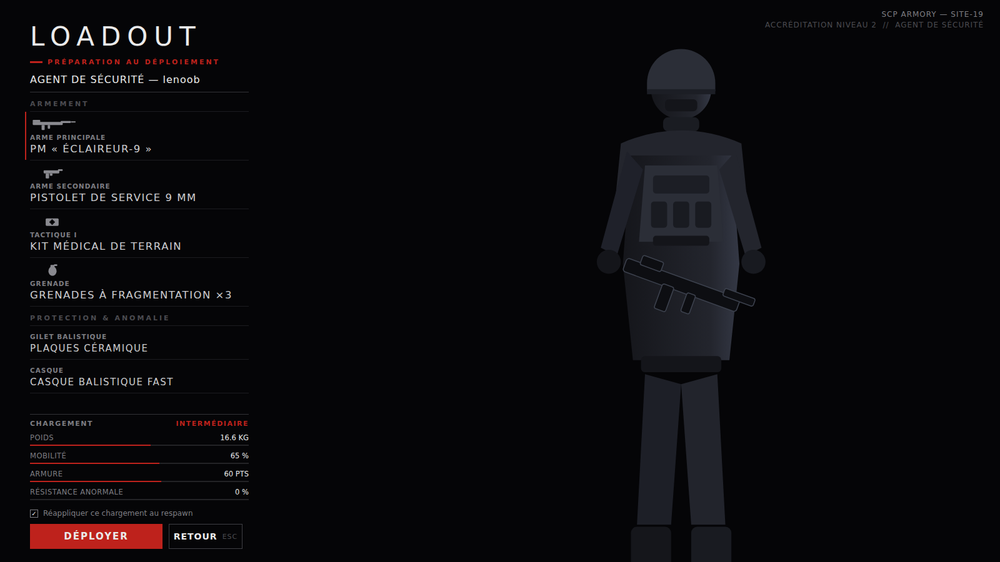
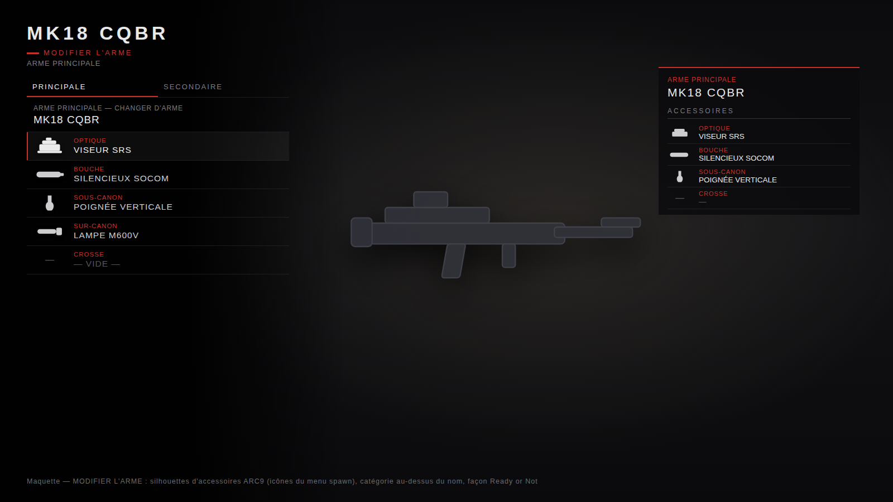

# SCP Armory

Addon **Garry's Mod** : une armurerie de la Fondation SCP qui recrée les écrans **LOADOUT** et
**MODIFY WEAPON** de **Ready or Not** — plein écran sur fond noir, colonne d'équipement à gauche,
opérateur (ou arme) en grand plan, accessoires **ARC9**, poids qui pénalise la mobilité,
restrictions par job et **chargement automatique des packs d'armes installés**.




## Fonctionnalités

- **Écran LOADOUT façon Ready or Not** (Derma, plein écran, fondu d'ouverture) :
  - 7 emplacements : arme principale, arme secondaire, tactique ×2, grenade, gilet balistique, casque ;
  - colonne d'équipement à gauche sur dégradé sombre, survols animés, votre playermodel en grand plan ;
  - munitions affichées sur les armes, descriptions et statistiques au survol ;
  - résumé du chargement en direct : **poids**, **mobilité**, **armure**, avec classe
    `LÉGER / INTERMÉDIAIRE / LOURD` ; navigation ÉCHAP comme dans le jeu.
- **Écran MODIFIER L'ARME façon Ready or Not** (armes principale et secondaire) :
  - onglets PRINCIPALE / SECONDAIRE, arme en grand plan, panneau récapitulatif des accessoires à droite ;
  - **intégration ARC9** : les emplacements (optique, bouche, sous-canon…) et les accessoires compatibles sont
    récupérés automatiquement depuis le registre ARC9 de l'arme — aucune configuration à écrire ;
  - les accessoires se choisissent **uniquement** ici : le menu de personnalisation ARC9 (touche C) est désactivé
    (`BlockARC9Customize`) ; le serveur valide et pose les accessoires au déploiement.
- **DÉPLOYER équipe le joueur et referme le menu** immédiatement.
- **Chargement automatique des packs d'armes** (`AutoLoadWeapons`) : toutes les armes scriptées
  spawnables installées (ARC9, M9K, CW…) sont ajoutées automatiquement — emplacement 1 → arme
  secondaire, emplacements 2/3 → arme principale. Aucune liste à écrire.
- **Restrictions par job** : chaque objet peut être réservé à certains métiers (nom exact du job
  DarkRP/team). Les joueurs des autres jobs **ne voient pas du tout** l'objet dans la sélection ;
  le serveur refuse aussi tout déploiement hors autorisation. Configurable **en jeu**, objet par objet.
- **Pas de niveaux d'accréditation** : tout objet visible est équipable — la seule limite est le job.
- **Icônes par images imgur** : chaque objet peut avoir une image (lien direct
  `https://i.imgur.com/xxxx.png`), qui remplace le rendu 3D dans les vignettes, les listes et le
  grand plan. Téléchargées une fois puis mises en cache dans `data/scp_armory/cache/`.
- **Panneau de configuration en jeu** (superadmin) : options générales, image imgur **et jobs
  autorisés de chaque objet**, avec aperçu. Sauvegardé côté serveur
  (`data/scp_armory/server_config.json`) et diffusé à tous les joueurs en direct.
- **Entité armoire d'armurerie** (`scp_armory_locker`) : une armoire à placer sur la map (menu spawn,
  catégorie *SCP Armory*, modèle configurable), étiquette 3D2D « ARMURERIE — Appuyez sur [E] ».
  Avec `RequireEntity = true`, s'équiper n'est possible **qu'à proximité d'une armoire**.
- **Sauvegarde locale** du dernier loadout + réapplication optionnelle au respawn.

## Installation

Clonez (ou copiez) le dépôt dans le dossier `addons` de Garry's Mod :

```
garrysmod/addons/scp-armory/
├── addon.json
└── lua/
    ├── autorun/scp_armory_init.lua
    ├── entities/scp_armory_locker/...
    └── scp_armory/...
```

## Utilisation

- **Armoire d'armurerie** : spawnez l'entité *Armoire d'armurerie SCP* (catégorie *SCP Armory*) et
  appuyez sur **E** dessus.
- Commande chat : `!armurerie`, `!loadout` ou `!armory`
- Commande console : `scp_armory` (bindable : `bind F7 scp_armory`)
- Choisissez vos objets par emplacement puis cliquez **DÉPLOYER** — le menu se referme et vous êtes équipé.

## Configuration

**En jeu (recommandé, superadmin)** :

- Commande chat : `!armurerieconfig` (ou `!armoryconfig`, `!configarmurerie`)
- Commande console : `scp_armory_config`
- Ou le bouton **CONFIGURATION** en haut à droite de l'armurerie.

Le panneau règle les options générales, l'image imgur et les **jobs autorisés** de chaque objet
(armes auto-chargées comprises), puis sauvegarde côté serveur et synchronise tous les joueurs.

**Dans les fichiers** — `lua/scp_armory/sh_config.lua` (valeurs par défaut, écrasées par la
configuration en jeu) :

| Option | Rôle |
| --- | --- |
| `AutoLoadWeapons` | Charge automatiquement les armes des packs installés (redémarrage requis) |
| `AutoLoadBlacklist` | Classes d'armes à exclure du chargement automatique |
| `RequireEntity` | Si `true`, menu et déploiement uniquement près d'une armoire `scp_armory_locker` |
| `UseDistance` | Portée (en unités) autour de l'armoire quand `RequireEntity = true` |
| `LockerModel` | Modèle 3D de l'armoire d'armurerie |
| `BlockARC9Customize` | Si `true`, désactive le menu de personnalisation ARC9 (touche C) |
| `BaseWalkSpeed` / `BaseRunSpeed` | Vitesses de référence avant malus de poids |
| `MaxArmor` | Plafond d'armure |
| `KeepWeapons` | Outils sandbox redonnés après déploiement (physgun, toolgun…) |

ConVar serveur : `scp_armory_autoapply 1/0` — autorise la réapplication du loadout au respawn.

## Limiter les armes par job

Dans le panneau de configuration en jeu, chaque objet a un champ **JOBS** : entrez les noms exacts
des métiers séparés par des virgules (ex. `Agent de sécurité, Chef des FGM`). Champ vide = visible
par tout le monde. Comme dans Ready or Not, un joueur ne voit **que** l'arsenal de son métier.

En code, c'est le champ `jobs = { "Agent de sécurité" }` sur un objet de `sh_items.lua`.

## Accessoires ARC9

Si une arme (écrite à la main ou auto-chargée) est une arme **ARC9**, l'écran *MODIFIER L'ARME*
liste automatiquement ses emplacements de premier niveau (`SWEP.Attachments`) et les accessoires
compatibles du registre `ARC9.Attachments`. Au déploiement, le serveur valide chaque accessoire
(emplacement + compatibilité) puis le pose sur l'arme donnée (`SWEP:Attach`, avec repli défensif).

La pose au déploiement reproduit le chemin serveur d'ARC9 (`BuildSubAttachments` sur l'arbre complet
puis `SendWeapon`/`PostModify`) : elle est diffusée aux clients et **ne dépend ni de l'inventaire
d'accessoires ARC9 ni d'aucune ConVar** — pas besoin de `arc9_free_atts`.

- Les joueurs ne passent **jamais** par le menu ARC9 : la touche C est bloquée sur les armes ARC9
  tant que `BlockARC9Customize = true`. Pour verrouiller aussi côté serveur, vous pouvez en plus
  mettre `arc9_atts_nocustomize 1` : l'armurerie continue de fonctionner.
- L'aperçu de l'écran *MODIFIER L'ARME* affiche le viewmodel de l'arme **avec les accessoires
  équipés posés dessus** (même calcul de placement qu'ARC9 : os de l'emplacement + offsets).
- Les emplacements imbriqués (rails ajoutés par un autre accessoire) ne sont pas proposés — seul le
  premier niveau l'est, pour garder une validation serveur simple et sûre.
- Sans ARC9 installé, tout le reste de l'addon fonctionne normalement.

## Images imgur des objets

Pour un rendu propre façon Ready or Not, donnez à chaque arme/objet une image **en lien direct
imgur** (clic droit sur l'image → « Copier l'adresse de l'image », le lien doit commencer par
`https://i.imgur.com/` et finir par `.png` ou `.jpg`, idéalement sur fond transparent) :

- **en jeu** : panneau de configuration → section *OBJETS*, collez l'URL, l'aperçu se charge,
  puis **ENREGISTRER ET DIFFUSER** ;
- **dans le code** : champ `icon = "https://i.imgur.com/xxxx.png"` dans `sh_items.lua`.

Sans image, le menu retombe sur le rendu 3D du modèle (`model`). Les images sont mises en cache
localement (`data/scp_armory/cache/`) et ne sont téléchargées qu'une seule fois par client.

## Ajouter des armes à la main

Le chargement automatique couvre la plupart des cas. Pour une entrée sur mesure (nom français,
stats affichées, munitions précises), ajoutez un objet dans `lua/scp_armory/sh_items.lua` :

```lua
{
    id = "m9k_mp5", name = "H&K MP5A5",
    desc = "PM de dotation des FGM.",
    weight = 3.1,
    class = "m9k_mp5", model = "models/weapons/w_hk_mp5.mdl",
    icon = "https://i.imgur.com/XXXXXXX.png",
    jobs = { "Agent de sécurité" },
    stats = { degats = 55, cadence = 82, controle = 75, precision = 62 },
},
```
